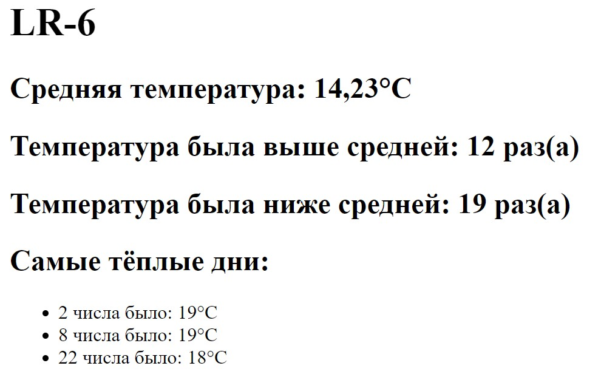

# Lab-6
## Задание
Создать сервлет и взаимодействующие с ним пакеты Java-классов и HTML-документов.
Готовое веб-приложение разместить на сервере Tomcat.
Информация о среднесуточной температуре воздуха за месяц задана в виде списка, хранящегося в файле.

Определить:
1. среднемесячную температуру воздуха
2. количество дней, когда температура была выше среднемесячной
3. количество дней, когда температура опускалась ниже среднемесячной
4. три самых теплых дня

## Результат

